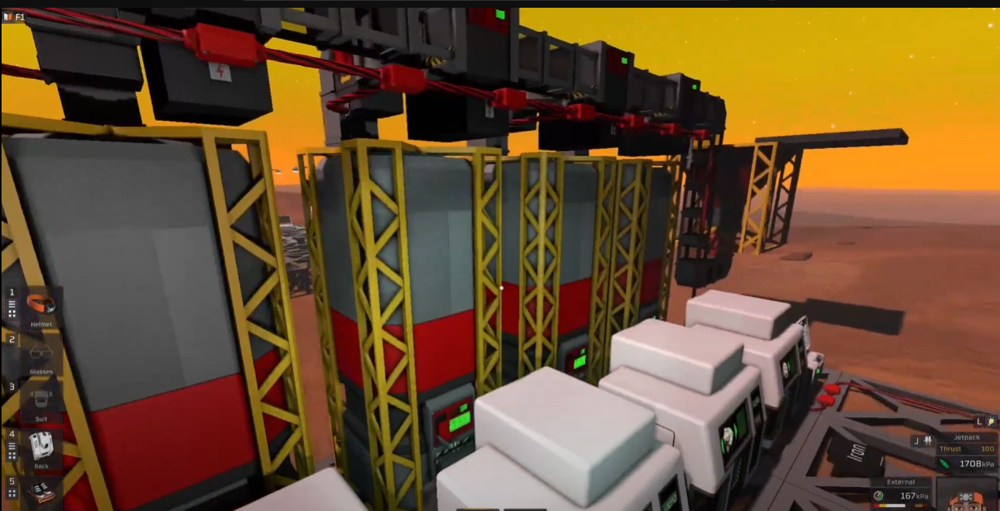
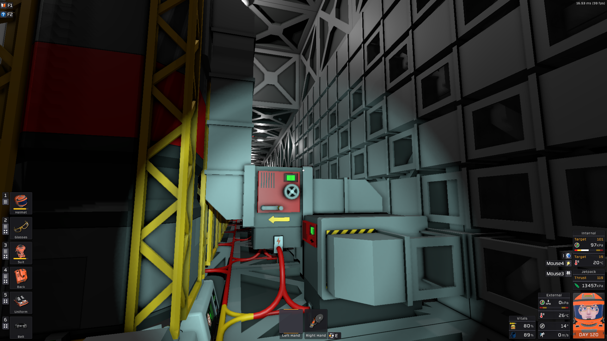

A cleaner chute layout when placing devices as seen here 

my go-to approach typically requires more chutes since the default setting of the sorters (at the time) could not be swapped... resulting in a "wasteful" crossover in the backend

example

